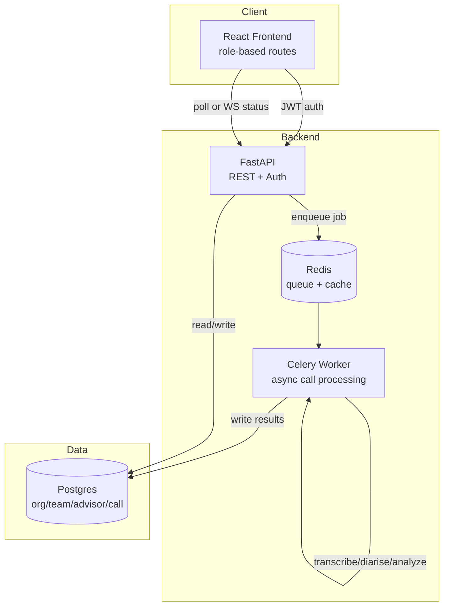

# FitNova Sales-Call Analyzer — Full-Stack Upgrade Plan

**Goal:** Evolve the current backend-heavy prototype (FastAPI + Postgres + Streamlit) into a
true full-stack application (FastAPI + Postgres + Redis/Celery + React frontend + real auth),
without breaking anything that already works.

**Approach:** Versioned rollout, same discipline as the APDS multi-agent upgrade — each
version is independently runnable and checkpoint-verified before moving to the next. Old
Streamlit dashboard stays alive and functional until the React frontend reaches parity, so
you always have a working demo.

**Current baseline (v1.0 — already built, do not touch except where noted):**
- FastAPI backend, 9 REST endpoints
- Postgres: Org → Team → Advisor → Call hierarchy, idempotent via `(source_system, source_call_id)`
- Synchronous pipeline: `orchestrator.process_call()` — transcribe → diarise → analyze → store
- Streamlit dashboard: role-tailored views via dropdown (no real auth)
- Docker Compose: `db`, `api`, `dashboard` services
- Deployed on Render

---

## Architecture — Target State (v3.0)

---

## Version Roadmap

### v1.1 — API Hardening (foundation, no visible change)
**Why first:** Auth and async both depend on the API being clean. Do this before adding
new layers, not after — retrofitting pagination/error schemas around a live frontend is
more painful than doing it now.

- [ ] Add Pydantic response models for every endpoint (no raw dict/ORM returns)
- [ ] Add pagination to `GET /calls` (`limit`, `offset`, or cursor-based)
- [ ] Add filtering (`?team_id=`, `?advisor_id=`, `?status=`) to `GET /calls`
- [ ] Standardize error responses: `{"error": {"code": ..., "message": ...}}` via FastAPI exception handlers
- [ ] Add `/health` endpoint (needed later for Docker healthchecks on new services)

**Checkpoint:** Existing Streamlit dashboard still works unmodified against the hardened API.
Run full docker-compose, click through all 3 dashboard views, confirm no regressions.

---

### v1.2 — Authentication & Authorization
**Why before frontend:** Building React screens against an unauthenticated API means
rebuilding routing logic later. Get auth into the API first; React just consumes it.

- [ ] New table: `users` (id, email, hashed_password, role, advisor_id FK nullable, team_id FK nullable)
  - Role enum: `advisor`, `team_leader`, `director`
  - `advisor` role links to one `advisors.id`; `team_leader` links to one `teams.id`; `director` has no FK (org-wide)
- [ ] `POST /auth/login` → JWT access token (short-lived) + refresh token
- [ ] `python-jose` or `fastapi-users` for JWT handling — pick `fastapi-users` if you want less
      boilerplate, `python-jose` + custom middleware if you want to understand every line
      (given your learning style, custom middleware is probably the better call here)
- [ ] Dependency-injected `get_current_user()` in FastAPI, scoped decorators:
  - `require_role("director")` → org-wide endpoints
  - `require_role("team_leader", "director")` → team-scoped endpoints
  - Row-level filtering: advisor can only ever query their own `advisor_id`, enforced in the
    query layer, not just hidden in the UI
- [ ] Seed script: create one dummy user per role for demo purposes (`seed_users.py`)

**Checkpoint:** `curl` test — advisor token hitting another advisor's calls returns 403.
Director token hitting anything returns 200. Document this test in `docs/auth_test.md`.

---

### v2.0 — React Frontend (replaces Streamlit as primary UI)
**Why this scope, not more:** Match existing Streamlit feature set first — don't add new
features while also changing the whole stack. Feature parity, then polish.

- [ ] `frontend/` — Vite + React (lighter and faster than Next.js for this size; you don't
      need SSR since this is an internal dashboard, not a public-facing site)
- [ ] Routing: `react-router` — `/login`, `/director`, `/team/:teamId`, `/advisor/:advisorId`
- [ ] Auth flow: login form → store JWT (memory + httpOnly refresh cookie, not localStorage —
      matches your artifact-safety habits from other projects) → attach to API requests
- [ ] Pages to rebuild from Streamlit, in this order (easiest → hardest):
  1. Advisor view (single advisor's own calls + scores)
  2. Team Leader view (team roster + per-advisor rollups)
  3. Director view (org health, cross-team comparison)
- [ ] Charting: `recharts` for score trends, tag frequency
- [ ] New Docker service: `frontend` (Vite build → served via nginx or `serve`)
- [ ] Update `docker-compose.yml`: add `frontend` service, keep `dashboard` (Streamlit)
      running in parallel on a different port until parity is confirmed

**Checkpoint:** Side-by-side comparison — every number/chart the Streamlit dashboard shows,
the React app shows the same value for the same advisor/team. Only then remove Streamlit.

---

### v2.1 — Remove Streamlit, Finalize Frontend
- [ ] Delete `dashboard/` service from docker-compose once v2.0 checkpoint passes
- [ ] Update README architecture diagram to reflect React as the only frontend
- [ ] Update "Real vs Mocked" table: Auth row changes from "Mocked" to "Real — JWT, role-scoped"

---

### v2.2 — Async Processing (Celery + Redis)
**Why after frontend, not before:** Async processing changes the API contract
(`POST /calls/{id}/process` returns `202` + job id instead of blocking until done). Better
to design the frontend against this contract once, rather than retrofit polling logic into
already-built pages.

- [ ] Add `redis` service to docker-compose
- [ ] `celery_app.py` — Celery app instance, Redis as broker + result backend
- [ ] Move `orchestrator.process_call()` body into a Celery task (`tasks.py`); orchestrator
      becomes a thin wrapper that either calls the task directly (sync/dev mode) or `.delay()`s
      it (async/prod mode) — keep both paths so local testing doesn't require Redis running
- [ ] `POST /calls/{id}/process` → enqueue, return `{"job_id": ..., "status": "queued"}`
- [ ] `GET /calls/{id}/status` → poll endpoint reading Celery task state
- [ ] New Docker service: `worker` (runs `celery -A celery_app worker`)
- [ ] Frontend: replace "processing..." spinner with actual polling (every 2s) against
      `/calls/{id}/status`

**Checkpoint:** Submit 5 calls at once, confirm they process concurrently (not serially),
confirm idempotency still holds if the same call is queued twice.

---

### v3.0 — Real-Time Status (optional polish)
Only do this if v2.2 polling feels laggy in practice. Not required for "full stack" — skip
unless you specifically want the WebSocket experience on your resume.

- [ ] WebSocket endpoint in FastAPI (`/ws/calls/{id}`)
- [ ] Frontend: replace polling with WebSocket subscription for live status updates

---

## Tech Stack Summary

| Layer | Choice | Why |
|---|---|---|
| Frontend | React + Vite | Lighter than Next.js, no SSR needed for internal dashboard |
| Auth | FastAPI + python-jose (custom JWT) | Matches your preference for understanding every layer over black-box libraries |
| Queue | Celery + Redis | Industry-standard, well-documented, Render has managed Redis add-on |
| Charts | Recharts | Already familiar territory if you've used it in ML dashboards before |
| Deployment | Render, 5 services (db, redis, api, worker, frontend) | Same platform as now, just more services |

---

## What Stays Exactly The Same (do not touch)
- `orchestrator.py` core logic (transcribe → analyze → store) — only wrapped in a Celery task, not rewritten
- `verifier.py`, `diarizer.py`, `transcriber.py` — untouched, already solid
- Postgres schema — only additive changes (`users` table), no migrations that alter existing tables
- Existing REST endpoints — extended (pagination, auth) not replaced

## Rough Time Estimate
| Version | Estimated Hours |
|---|---|
| v1.1 API Hardening | 2–3 hrs |
| v1.2 Auth | 4–5 hrs |
| v2.0 React Frontend | 8–10 hrs |
| v2.1 Cleanup | 1 hr |
| v2.2 Celery/Redis | 3–4 hrs |
| v3.0 WebSockets (optional) | 2–3 hrs |
| **Total (through v2.2)** | **~18–23 hrs** |

## Suggested Order of Attack
Do v1.1 → v1.2 → v2.0 → v2.1 → v2.2 in that exact order. Each version is independently
demo-able, so if you run out of time partway through, you still have a working, honestly-
labeled system — never a half-broken one.
