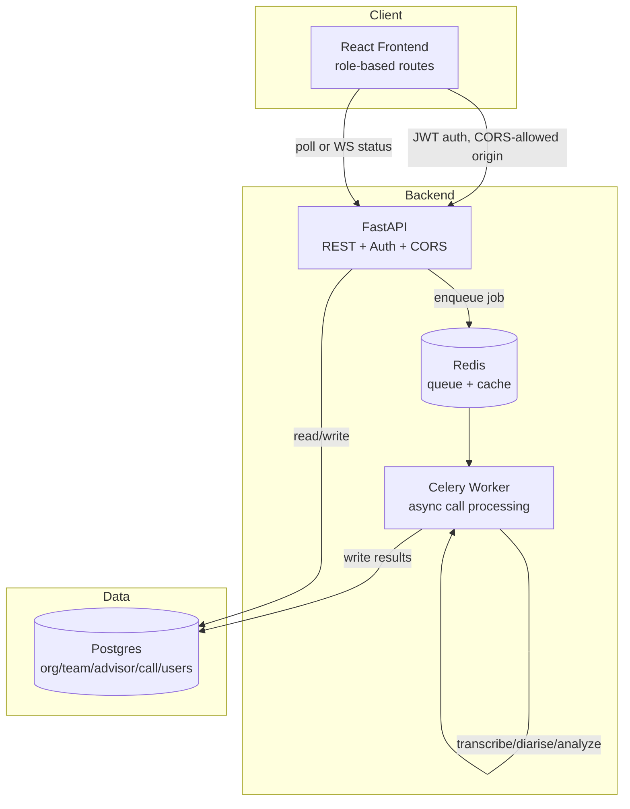

# FitNova Full-Stack Platform — Build Plan

This repo is an extended, production-readiness version of
[Fitnova-sales-call-analyzer](https://github.com/Divyanshi018572/Fitnova-sales-call-analyzer),
built **after** that repo's take-home assignment was submitted, in a fully separate repo so the
original submission is never at risk of being touched or broken.

**Goal:** evolve the backend-heavy prototype (FastAPI + Postgres + Streamlit) into a true
full-stack application (FastAPI + Postgres + Redis/Celery + React frontend + real auth), without
breaking anything that already works.

**Approach:** versioned rollout. Each version is independently runnable and checkpoint-verified
before moving to the next. The old Streamlit dashboard stays alive and functional until the React
frontend reaches parity, so there is always a working demo.

This file is the single source of truth for scope and sequencing, same convention as the original
repo's `PLAN.md`. Re-read it after finishing every version, before starting the next one.

---

## 0. Baseline (v1.0 — already built, carried over from the original repo)

- FastAPI backend, 9 REST endpoints (10 in practice — `GET /contests/pending` was added late in
  the original repo; carry it over as-is, documented, not a bug)
- Postgres: Org → Team → Advisor → Call hierarchy, idempotent via `(source_system, source_call_id)`
- Synchronous pipeline: `orchestrator.process_call()` — transcribe → diarise → analyze → store
- Streamlit dashboard: role-tailored views via dropdown (no real auth)
- Docker Compose: `db`, `api`, `dashboard` services
- Deployed on Render

---

## 1. Repo setup (do this before anything else)

This repo is created by cloning the original with full history preserved, then re-pointing the
remote — not by copy-pasting files. This keeps the commit history and milestone tags intact.

```bash
git clone https://github.com/Divyanshi018572/Fitnova-sales-call-analyzer.git fitnova-fullstack-platform
cd fitnova-fullstack-platform
git remote remove origin
git remote add origin <new-repo-url>
git remote -v   # confirm both fetch and push point to the NEW repo before doing anything else
git push -u origin main
git push origin --tags
```

Add one line at the top of this repo's `README.md`:
> This is an extended version of
> [Fitnova-sales-call-analyzer](https://github.com/Divyanshi018572/Fitnova-sales-call-analyzer),
> built beyond the original take-home assignment scope to demonstrate production-readiness
> (auth, async processing, a React frontend).

---

## 2. Target architecture (v3.0)



---

## 3. Version roadmap

### v1.1 — API hardening (foundation, no visible change)
**Why first:** auth and async both depend on the API being clean. Retrofitting pagination,
error schemas, and CORS around a live frontend is more painful than doing it now.

- [x] Add Pydantic response models for every endpoint (no raw dict/ORM returns).
- [x] Add pagination to `GET /calls` (`limit`, `offset`).
- [x] Add filtering (`?team_id=`, `?advisor_id=`, `?status=`) to `GET /calls`.
- [x] Standardize error responses via FastAPI exception handlers:
      `{"error": {"code": ..., "message": ...}}`.
- [x] **Add CORS middleware** (`fastapi.middleware.cors.CORSMiddleware`), allowed origins read
      from an env var (`ALLOWED_ORIGINS`), not hardcoded — defaults to `http://localhost:5173`
      (Vite's dev port) locally, set to the real frontend URL in Render. This was missing from
      the first draft of this plan and would have silently blocked every browser request from
      the React app in v2.0 if left until then.
- [x] Add a `/health` endpoint (needed later for Docker healthchecks on new services).

**Checkpoint:** existing Streamlit dashboard still works unmodified against the hardened API.
Full `docker-compose up --build`, click through all 3 dashboard views, confirm no regressions.
Run the full existing test suite — everything that passed before must still pass.

---

### v1.2 — Authentication & authorization
**Why before frontend:** building React screens against an unauthenticated API means rebuilding
routing logic later. Get auth into the API first; React just consumes it.

- [ ] **Migration strategy for the new `users` table** (this repo has no Alembic set up yet;
      don't silently `Base.metadata.create_all()` against a live database with real data):
  - Write a plain, versioned SQL migration file: `migrations/0001_add_users_table.sql`, with a
    matching `migrations/0001_add_users_table_rollback.sql`.
  - Apply it manually and document the exact command in `docs/migrations.md` (e.g.
    `psql $DATABASE_URL -f migrations/0001_add_users_table.sql`).
  - This is intentionally lightweight — not introducing Alembic for one table — but it must be
    scripted and documented, not applied ad-hoc from a Python shell.
- [ ] New table: `users` (id, email, hashed_password, role, advisor_id FK nullable, team_id FK
      nullable).
  - Role enum: `advisor`, `team_leader`, `director`.
  - `advisor` role links to one `advisors.id`; `team_leader` links to one `teams.id`; `director`
    has no FK (org-wide).
- [ ] `JWT_SECRET_KEY` added to `.env.example` and `config.py` (`Settings` class) — never
      hardcoded, never committed with a real value.
- [ ] `POST /auth/login` → JWT access token (short-lived) + refresh token.
- [ ] JWT handling via `python-jose` + custom middleware (not `fastapi-users`) — more lines of
      code, but every layer is understandable and debuggable, which matters more here than
      saving boilerplate.
- [ ] Dependency-injected `get_current_user()` in FastAPI, scoped decorators:
  - `require_role("director")` → org-wide endpoints.
  - `require_role("team_leader", "director")` → team-scoped endpoints.
  - Row-level filtering: an advisor can only ever query their own `advisor_id`, enforced in the
    query layer, not just hidden in the UI.
- [ ] Seed script: create one dummy user per role for demo purposes (`seed_users.py`).

**Checkpoint:** `curl` test — advisor token hitting another advisor's calls returns 403. Director
token hitting anything returns 200. Document this test in `docs/auth_test.md`.

---

### v2.0 — React frontend (replaces Streamlit as primary UI)
**Why this scope, not more:** match the existing Streamlit feature set first — don't add new
features while also changing the whole stack. Feature parity, then polish.

- [ ] `frontend/` — Vite + React (lighter than Next.js; no SSR needed for an internal dashboard).
- [ ] Routing: `react-router` — `/login`, `/director`, `/team/:teamId`, `/advisor/:advisorId`.
- [ ] Auth flow: login form → store JWT (memory + httpOnly refresh cookie, not localStorage) →
      attach to API requests.
- [ ] Pages to rebuild from Streamlit, easiest → hardest:
  1. Advisor view (own calls + scores)
  2. Team Leader view (team roster + per-advisor rollups)
  3. Director view (org health, cross-team comparison)
- [ ] Charting: `recharts` for score trends, tag frequency.
- [ ] New Docker service: `frontend` (Vite build → served via nginx or `serve`).
- [ ] Update `docker-compose.yml`: add `frontend` service, keep `dashboard` (Streamlit) running
      in parallel on a different port until parity is confirmed.

**Checkpoint:** side-by-side comparison — every number/chart the Streamlit dashboard shows, the
React app shows the same value for the same advisor/team. Only then remove Streamlit.

---

### v2.1 — Remove Streamlit, finalize frontend
- [ ] Delete the `dashboard` service from `docker-compose.yml` once the v2.0 checkpoint passes.
- [ ] Update the README architecture diagram to reflect React as the only frontend.
- [ ] Update the "Real vs Mocked" table: Auth row changes from "Mocked" to "Real — JWT,
      role-scoped."

---

### v2.2 — Async processing (Celery + Redis)
**Why after frontend, not before:** async processing changes the API contract
(`POST /calls/{id}/process` returns `202` + job id instead of blocking until done). Better to
design the frontend against this contract once, rather than retrofit polling logic into
already-built pages.

**This version breaks existing tests — plan for it explicitly, don't discover it mid-refactor:**
- [ ] Before touching `orchestrator.py`, list every existing test that asserts on
      `POST /calls/{id}/process`'s response (`test_pipeline_e2e.py`, `test_api.py` from the
      original repo). Update their assertions to expect `202` + `{"job_id": ...}` in the same
      commit that changes the endpoint — never leave them red between commits.
  - Add a **new** test that polls `/calls/{id}/status` until `done`/`failed`, then asserts on the
    final stored result the same way the old synchronous test did. This replaces the old
    "process and immediately assert" pattern.
- [ ] Add a `redis` service to `docker-compose.yml`.
- [ ] `celery_app.py` — Celery app instance, Redis as broker + result backend.
- [ ] Move `orchestrator.process_call()`'s body into a Celery task (`tasks.py`); orchestrator
      becomes a thin wrapper that either calls the task directly (sync/dev mode, no Redis
      required) or `.delay()`s it (async/prod mode) — keep both paths so local testing doesn't
      require Redis running.
- [ ] `POST /calls/{id}/process` → enqueue, return `{"job_id": ..., "status": "queued"}`.
- [ ] `GET /calls/{id}/status` → poll endpoint reading Celery task state.
- [ ] New Docker service: `worker` (runs `celery -A celery_app worker`).
- [ ] Frontend: replace the "processing..." spinner with actual polling (every 2s) against
      `/calls/{id}/status`.

**Checkpoint:** submit 5 calls at once, confirm they process concurrently (not serially), confirm
idempotency still holds if the same call is queued twice. Full test suite green, including the
updated and new tests above.

---

## 4. Tech stack summary

| Layer | Choice | Why |
|---|---|---|
| Frontend | React + Vite | Lighter than Next.js, no SSR needed for an internal dashboard |
| Auth | FastAPI + `python-jose` (custom JWT) | Every layer understandable and debuggable over a black-box library |
| CORS | `fastapi.middleware.cors.CORSMiddleware`, env-driven allowed origins | Required the moment the frontend and API are on different origins — added in v1.1, not retrofitted later |
| Queue | Celery + Redis | Industry-standard, well-documented, Render has a managed Redis add-on |
| Charts | Recharts | Pairs well with a Vite/React stack, minimal setup |
| DB migrations | Plain versioned SQL files (`migrations/000X_*.sql` + rollback) | One new table doesn't justify introducing Alembic; still needs to be scripted and documented, not ad-hoc |
| Deployment | Render, 5 services (db, redis, api, worker, frontend) | Same platform as the original repo, just more services |

---

## 5. What stays exactly the same (do not touch)

- `orchestrator.py` core logic (transcribe → analyze → store) — only wrapped in a Celery task in
  v2.2, not rewritten.
- `verifier.py`, `diarizer.py`, `transcriber.py`, `llm_client.py`, `rubric.py` — untouched,
  already solid and tested.
- Postgres schema for existing tables — only additive changes (`users` table via a documented
  migration), no altering or dropping existing tables/columns.
- Existing REST endpoints — extended (pagination, auth, and in v2.2 the process-endpoint
  contract), not silently replaced without updating both the tests and this document first.

---

## 6. Sequencing note (not a deadline)

The version order — v1.1 → v1.2 → v2.0 → v2.1 → v2.2 → (optional v3.0) — is fixed; do not
reorder it, the dependencies between versions are real (auth before frontend, frontend before
async). Hour/day estimates are deliberately not included here: they were a source of
false-precision guesswork in the original repo's planning and aren't repeated here. Track actual
time per version in `BUILD_LOG.md` instead, and let that — not a guess made before writing any
code — inform how much time the remaining versions realistically need.

Each version is independently demo-able. If time runs out partway through, whatever was last
checkpointed is a valid, honestly-labeled stopping point — never leave a version half-migrated.
