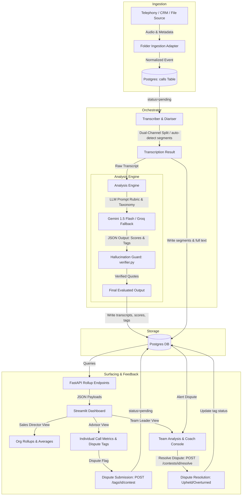

# FitNova Sales-Call Intelligence

This repository contains the prototype for the **FitNova Sales-Call Intelligence** system. The system automatically ingests, transcribes, diarises, redacts PII, scores, and audits sales calls for FitNova wellness and fitness coaching programs, featuring an interactive human-in-the-loop feedback loop.

---

## 🌐 Deployed Services (Render)

The prototype is containerized and deployed on Render. You can access the interfaces directly at the links below:

*   **Interactive Web Dashboard**: [https://fitnova-dashboard-8u7r.onrender.com](https://fitnova-dashboard-8u7r.onrender.com)
*   **FastAPI Backend Base URL**: [https://fitnova-api-os8d.onrender.com](https://fitnova-api-os8d.onrender.com)
*   **Interactive API Documentation (Swagger)**: [https://fitnova-api-os8d.onrender.com/docs](https://fitnova-api-os8d.onrender.com/docs)

---

## 🏗️ System Design & Pipeline Architecture

### Pipeline Architecture Diagram



### Pipeline Stages Walkthrough

1. **Ingestion**: The ingestion adapter normalizes metadata from varying telephony/CRM sources. For the prototype, the `FolderAdapter` monitors a directory for audio files and creates a record in the `calls` table with a `pending` status.
2. **Transcription & Diarisation**: The call is fetched and processed. It uses `faster-whisper` for multilingual transcription (auto-detecting segment language to handle English-Hindi code-switching). It splits stereo files into two channels (Advisor/Customer) for cheap, deterministic speaker diarisation.
3. **Analysis & Tagging**: An LLM (`gemini-1.5-flash` with auto-fallback to `llama-3.3-70b` on Groq) analyzes the transcript against the FitNova sales rubric and issue taxonomy. It scores performance and tags compliance violations.
4. **Verification**: The `verifier.py` component performs literal string matching to verify that any LLM-asserted "quoted compliance violation" actually exists in the raw transcription text. Hallucinated tags are discarded.
5. **Storage**: The orchestrator updates the database transactionally. It marks the call `done` and saves the transcript, scores, and verified tags.
6. **Surfacing (Dashboard)**: Streamlit displays three role-tailored views. The Sales Director views org rollups, Team Leaders view team averages, and Advisors view their individual scores.
7. **Feedback Loop (Contests)**: Advisors can click a button to contest a flag. This creates a contest record. Team Leaders can review the transcript, check the advisor's note, and resolve the contest as either "Upheld" or "Overturned," dynamically adjusting metrics.

---

## 🏗️ System Architecture Overview

The system runs as three dockerized services:
1. **Database (`db`)**: PostgreSQL 15 alpine database storing organizations, teams, advisors, calls, transcripts, scores, compliance tags, and contest records.
2. **API Backend (`api`)**: FastAPI service running the orchestration pipeline (Ingestion -> Stereo splitting -> Whisper Transcription -> PII Redaction -> Gemini LLM Scoring -> Hallucination Verifier -> PostgreSQL Storage) and serving rollup metrics.
3. **Dashboard (`dashboard`)**: Streamlit application providing custom views for the Sales Director, Team Leaders, and Advisors.

---

## 💻 Local Setup & Run

### Prerequisites
- Docker & Docker Compose installed.
- (Optional) A Gemini API key. If absent, the system falls back to a mock evaluator.

### Steps
1. Create a local `.env` file in the root directory (based on `.env.example`):
   ```bash
   cp .env.example .env
   ```
   Add your API keys in the `.env` file:
   ```env
   GEMINI_API_KEY=your_gemini_api_key_here
   GROQ_API_KEY=your_groq_api_key_here
   ```
2. Build and launch all services locally:
   ```bash
   docker-compose up --build
   ```
3. Access the interfaces:
   - **FastAPI Base API URL**: [http://localhost:8000](http://localhost:8000)
   - **Interactive API Documentation (Swagger)**: [http://localhost:8000/docs](http://localhost:8000/docs)
   - **Streamlit Dashboard Web App**: [http://localhost:8501](http://localhost:8501)

4. Run all unit and E2E integration tests:
   ```bash
   docker exec fitnova_api python -m pytest
   ```

---

## ⚖️ Real vs. Mocked Systems

| Component | Status | Description |
|---|---|---|
| Ingestion Source | Mocked | Ingests calls from a local directory (`data/mock_calls/`) rather than live telephony webhooks. |
| Call Audio Samples | Mocked | Audio is sourced from the public dataset [snorbyte/indic-audio-dialog-sample](https://huggingface.co/datasets/snorbyte/indic-audio-dialog-sample) on Hugging Face to test Hindi-English code-switched speech rather than real FitNova calls. |
| Transcription / Diarisation | Real | Runs locally using `faster-whisper` and split-channel stereo audio diarisation. |
| PII Redaction | Real | Runs locally in the orchestration pipeline using a regex-based pass to mask phone numbers, emails, credit cards, Aadhaar, and PAN numbers before storage or LLM call. |
| Call Scoring / Tagging | Real | Integrates with Gemini 1.5 Flash API with automated fallback to Groq Llama 3.3. |
| Database Storage | Real | Persists all call records, transcripts, scores, and tags to a PostgreSQL database. |
| Organization Rollups | Real | Computes live averages and trends per team and advisor on database records. |
| Feedback Loop / Contests | Real | Allows advisors to contest tags and team leaders to resolve contests via DB updates. |

---

## 🔒 PII Redaction
To protect advisor and customer privacy, the orchestration pipeline executes a high-performance regex redaction pass (`redact_text`) *after* transcription but *before* the transcript is stored or sent to the LLM. It successfully masks:
- **Email addresses** (e.g. `customer@email.com` -> `[EMAIL_REDACTED]`)
- **Phone numbers** including international/Indian formats with leading `+` signs (e.g. `+91 99999 88888` -> `[PHONE_REDACTED]`)
- **Credit card numbers** (13 to 16 digits)
- **Indian Aadhaar card numbers** (12 digits)
- **Indian PAN card numbers** (e.g. `ABCDE1234F`)

---

## 📝 Case Study Submission Writeup

A comprehensive project writeup detailing Sections A, B, and C is available in the repository at:
📄 **[Project Writeup](file:///d:/DATA%20SCIENCE/saas%20APPs/fake_call_detect/docs/07-writeup.md)**

*   **Section A: System Architecture & Value Justification**: Overview of pipeline stages, justification of technology choices, and identification of high-value automation targets.
*   **Section B: Evaluation Rubric & LLM Engineering**: Details on the 5-dimension scoring rubric, automated compliance deductions, LLM fallback configuration (Gemini -> Groq -> Mock), and the verifier hallucination guard.
*   **Section C: Human-in-the-Loop (HITL) Dispute Resolution**: Explanation of the dispute filing, team leader review, and dynamic score recalculation flow.
