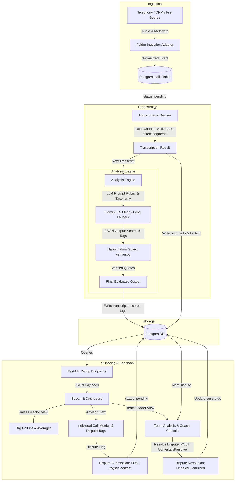

# System Design: FitNova Sales-Call Intelligence

This document details the architecture and data flows for the FitNova Sales-Call Intelligence prototype. It maps how raw sales calls are ingested, processed, analyzed, stored, and surfaced to different roles within the organization, including the integrated human-in-the-loop feedback system.

---

## 1. Pipeline Architecture Diagram

---

## 2. Pipeline Stages Walkthrough

1. **Ingestion**: The ingestion adapter normalizes metadata from varying telephony/CRM sources. For the prototype, the `FolderAdapter` monitors a directory for audio files and creates a record in the `calls` table with a `pending` status.
2. **Transcription & Diarisation**: The call is fetched and processed. It uses `faster-whisper` for multilingual transcription (auto-detecting segment language to handle English-Hindi code-switching). It splits stereo files into two channels (Advisor/Customer) for cheap, deterministic speaker diarisation.
3. **Analysis & Tagging**: An LLM (`gemini-2.5-flash` with auto-fallback to `llama-3.3-70b` on Groq) analyzes the transcript against the FitNova sales rubric and issue taxonomy. It scores performance and tags compliance violations.
4. **Verification**: The `verifier.py` component performs literal string matching to verify that any LLM-asserted "quoted compliance violation" actually exists in the raw transcription text. Hallucinated tags are discarded.
5. **Storage**: The orchestrator updates the database transactionally. It marks the call `done` and saves the transcript, scores, and verified tags.
6. **Surfacing (Dashboard)**: Streamlit displays three role-tailored views. The Sales Director views org rollups, Team Leaders view team averages, and Advisors view their individual scores.
7. **Feedback Loop (Contests)**: Advisors can click a button to contest a flag. This creates a contest record. Team Leaders can review the transcript, check the advisor's note, and resolve the contest as either "Upheld" or "Overturned," dynamically adjusting metrics.

---

## 3. High-Value Automation Stages & Justification

Automation provides disproportionate leverage in two specific stages of the pipeline:

### 1. High-Throughput Compliance Tagging & Analysis (Highest Value)
- **Problem**: In a manual system, Team Leaders can only listen to a tiny percentage of calls (~5%). Large-scale compliance issues, mis-selling, or aggressive selling tactics go unnoticed until a customer complains.
- **Value of Automation**: By running every single call through an LLM scoring engine, FitNova achieves **100% compliance auditing coverage**. Automation acts as an intelligent high-throughput filter. Instead of managers randomly selecting calls, the system automatically surfaces the exact 5% of calls containing critical flags (e.g., over-promising or urgency tactics), allowing leaders to focus 100% of their human coaching time where it is needed most.

### 2. Deterministic Stereo-Channel Diarisation (Second Highest Value)
- **Problem**: Separating "who said what" (diarisation) is a major machine learning bottleneck. Blind speaker diarisation on mono audio (using embeddings and clustering) is computationally expensive, prone to overlap failures, and runs slowly on standard CPU environments.
- **Value of Automation**: Normalizing ingestion to separate stereo channels (Advisor on Channel 0, Customer on Channel 1) yields **deterministic speaker assignment at zero compute cost**. Prioritizing dual-channel diarisation avoids complex model tuning and delivers a bulletproof user experience for the prototype. We only fallback to blind diarisation (annotating with lower confidence) when mono files are ingested.

---

## 4. Prioritisation Rationale

The analysis engine and pipeline orchestrator were prioritized first because:
1. **Core Loop Validation**: A database and dashboard are useless without reliable transcriptions and verified tags. 
2. **LLM Trust and Guardrails**: Setting up the hallucination verifier early ensures the prototype generates trustworthy data. It prevents the Streamlit dashboard from displaying false compliance accusations to advisors, preserving trust in the system from day one.
